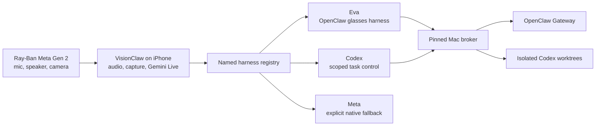

# VisionClaw Glasses Session Architecture

## Status

VisionClaw now contains a secure same-Wi-Fi implementation of the Personal
OpenClaw copilot. The known-working iPhone installation is intentionally left
in place until the new app, widget, signing identities, broker, and physical
glasses checks are all green.

Implemented:

- Ray-Ban Meta Gen 2 audio and DAT camera frames remain mediated by the iPhone.
- Gemini Live handles the natural audio and vision conversation.
- An extensible named-harness registry routes `Eva`, `Codex`, and `Meta`.
- A pinned, mutually authenticated Mac broker handles Eva and Codex without
  putting backend credentials on the phone.
- A lock-screen widget and App Shortcut foreground the dedicated glasses
  session handoff.
- Long-running Eva and Codex work acknowledges quickly and reports completion
  later without interrupting speech.

Not implemented:

- The authenticated outbound internet relay. Do not port-forward the Mac
  broker.
- Automatic media startup from the lock screen. iOS requires the foreground app
  to start camera and microphone access.
- Programmatic activation of Meta's native assistant. DAT does not expose that
  API.

## Experience

Invocation names are registry data rather than hard-coded speech branches. The
parser recognizes an optional wake phrase followed by a registered name. One
recognized name authorizes exactly one routed tool call; a backend response
cannot reuse it.

| Spoken target | Backend | Allowed behavior |
| --- | --- | --- |
| Eva | OpenClaw | Execute through the broker-selected `glasses` harness |
| Codex | Scoped Codex bridge | List/read/status tasks; prepare, explicitly confirm, monitor, or cancel a forked continuation |
| Meta | Native Meta assistant | Explain the handoff and tell the user to use the native control |

Unknown, unavailable, and unsupported targets produce explicit visible and
spoken status. They never silently reroute. A model-selected target must match
the name recognized from fresh microphone input.

## Same-Wi-Fi routing

1. The broker advertises `_visionclaw._tcp` with Bonjour.
2. `npm run pair` creates a single-use, two-minute QR offer.
3. The iPhone accepts only a private RFC1918 HTTPS endpoint, stages the offer,
   and shows the Mac suffix, address, and public-key fingerprint for explicit
   confirmation.
4. The broker accepts only the phone's P-256 signing key, stores its
   thumbprint, and grants only fixed scopes.
5. Every protected request has a fresh signed proof plus a one-shot,
   route-bound capability.
6. A signed, proof-only status request verifies that a stored pairing is
   genuinely reachable before the app reports the broker as connected.

Bonjour is discovery only. Its TXT data is never identity or authorization.
The paired HTTPS endpoint is currently stored with the pin; if the Mac's LAN
address changes, re-pair instead of trusting an unauthenticated discovery
record.

An incoming link cannot replace an existing pairing. The user must explicitly
forget the old pairing first. Corrupt or unreadable pairing state also fails
closed until it is explicitly forgotten; it never re-enables the legacy route.

The Mac provides a separate loopback-only administrative endpoint for listing
derived pairing references and revoking a phone. Every administrative request
also requires a stable random credential stored only in the broker's private
state and loaded by the local CLI. Revocation is persistent and takes effect
immediately.

## Future remote routing

Remote operation will use two outbound authenticated connections:

1. The Mac broker connects outward to a relay.
2. The iPhone connects outward to the same relay over TLS.
3. End-to-end pairing identity and scoped capabilities remain authoritative;
   the relay cannot widen scopes.
4. OpenClaw owner tokens, Codex credentials, shell commands, filesystem paths,
   raw RPC methods, and arbitrary model selectors never enter the app.

No remote relay is deployed in this increment. The computer must not be
exposed directly to the public internet.

## Security invariants

- Gemini receives no broker secret or Codex confirmation nonce.
- Completed backend text is wrapped as untrusted, tool-disabled status data
  before it is given to Gemini for speech.
- While a proactive status turn is active, any attempted model tool call is
  rejected locally.
- OpenClaw output is scrubbed before persistence and again on final outbound;
  returned Codex task metadata receives the same final boundary scrub. This
  includes quoted and nested JSON fields and exact credentials loaded by the
  broker. The exact user-approved continuation instruction and its hash are
  intentionally persisted as confirmation state.
- Pairing records, replay protection, operation receipts, and confirmation
  state persist in a private broker database.
- Codex task references are opaque. The phone cannot choose a source directory,
  writable root, sandbox policy, model, or RPC method.
- A Codex continuation rejects an active source task, rechecks its revision,
  creates a distinct detached Git worktree, and starts the turn with only that
  isolated workspace writable.
- Approval requests fail closed and direct the user to Codex Desktop.
- A continuation cannot be approved by Gemini. After preparation, VisionClaw
  presents a trusted iPhone confirmation sheet containing the exact task and
  instruction. Only the sheet's Confirm action may consume the private
  single-use nonce; the nonce and commit path never pass through the model.

The pre-existing legacy OpenClaw credential remains only as a migration
fallback when no secure broker pairing exists. Once a pairing exists, missing,
offline, unauthorized, or under-scoped broker state fails closed and does not
silently use the legacy route.

## Audio and response continuity

One `AVAudioSession`/`AVAudioEngine` owner handles capture and playback. The UI
labels `Glasses Audio` only when both input and output use Bluetooth HFP.

- A transient Bluetooth route-change notification is debounced so it does not
  flush queued speech.
- Recovery resets audio only if the route remains unavailable and the engine
  has actually stopped.
- A backend operation acknowledges quickly instead of making Gemini wait for
  execution.
- Completion arrives as a later status turn.
- A bounded post-tool watchdog releases input/video gating if Gemini omits
  `turnComplete`, without stopping queued playback.

A full media-services reset can still destroy in-memory playback; replay after
that OS-level reset is deferred to a later resilience milestone.

## Camera and media

### Snapshot

`capture_media` requests a fresh DAT JPEG while streaming. Only one capture is
pending at a time, it has an eight-second deadline, and success is reported only
after Gemini accepts the image. Manual and voice capture share one gate so a
stale callback cannot satisfy a newer request.

Voice capture also requires an explicit, matching photo or video request in the
current input-transcription epoch. The app—not Gemini—owns this one-shot
authorization, consumes it before touching the camera, and rejects replayed,
negated, ambiguous, wrong-kind, late, or model-only capture attempts.

### Video

Meta Wearables DAT 0.8 exposes camera frames and still-photo capture but no
record-video command. VisionClaw therefore gives an explicit native Meta
fallback instead of claiming a recording exists.

A future foreground recorder may consume bounded DAT sample buffers with
`AVAssetWriter`, but it must pass frame-drop, timestamp, finalization, thermal,
and physical playback tests first. Lock-screen recording is not promised.

## Lock-screen entry

The widget and `Open Glasses Session` App Intent foreground VisionClaw and
create a one-shot in-app handoff. The session screen then tells the user to
start streaming and tap Session. This is deliberately not a background
camera/microphone bypass.

## Remaining acceptance gates

Before replacing the working iPhone build:

1. Pass the full broker and iOS regression suites.
2. Build and inspect the signed app and embedded widget identifiers,
   entitlements, and profiles.
3. Run an independent security and integration review.
4. Start the final broker and pair the phone with a fresh QR.
5. Verify on physical glasses:
   - full-duplex HFP input/output;
   - `Eva` execution and delayed completion speech;
   - Codex list/read and trusted exact-instruction confirmation;
   - fresh snapshot analysis;
   - uninterrupted long spoken response;
   - transient Bluetooth route loss;
   - explicit Meta and video fallback.

Remote internet operation is a later milestone after the same-Wi-Fi acceptance
pass.
